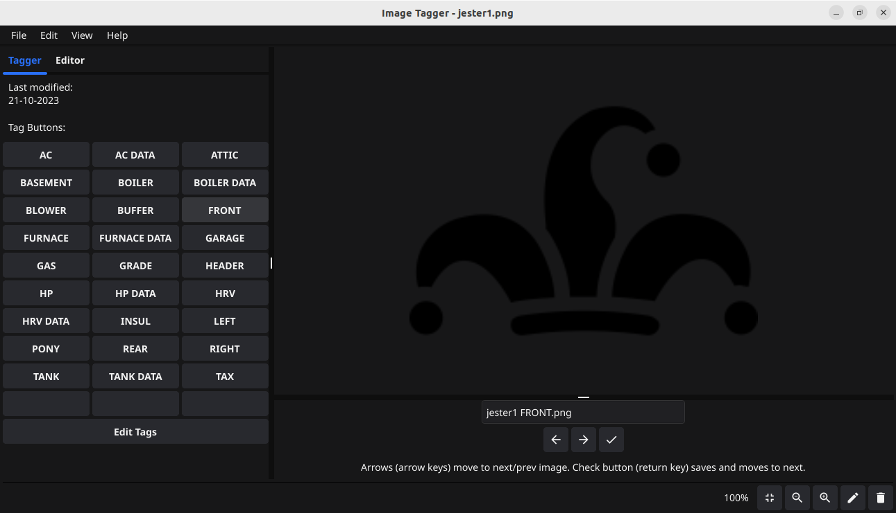

 

# Image Tagger 

## About

This is a simple image viewer lets you quickly tag (rename) image files.
It also includes some basic editing functionality. 

Forked from https://github.com/Palexer/image-viewer

## Screenshot

## Used Tools

- language: Go
- UI framework: fyne
- image processing backend: gift
- cross compilation: fyne-cross

## Installation

*Note for Mac users: There might be a warning, that the OS doesn't trust the application. In this case press Ctrl+left click on the
application and select open. Next time the app should open like any other program.

## Contributing

1. Fork this repository to your local machine
2. Add a new branch, make changes, merge to master branch
3. Make a pull request

## Development

### Linux

The following packages are required:
- gcc
- pkg-config
- libgl1-mesa-dev
- xorg-dev

## ToDo

- Hotkeys for tag buttons.

## Help

If you need any help, feel free to open a [new Issue](https://github.com/Palexer/image-viewer/issues/new).

## License

[MIT](LICENSE)
